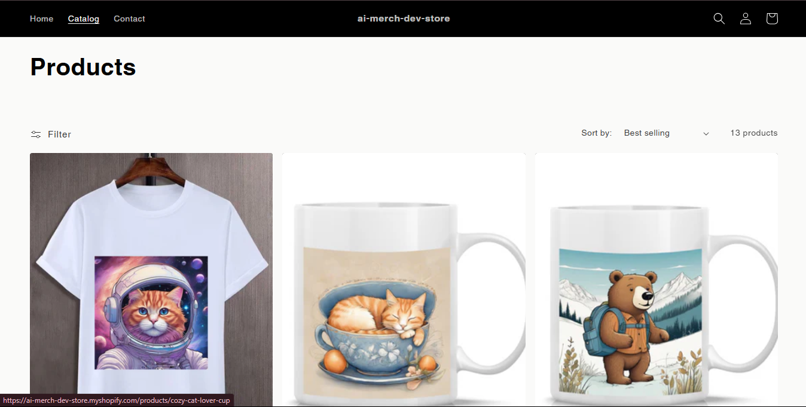

# 🛍️ AI Merch Maker Lite

**AI Merch Maker Lite** is an automated backend pipeline that runs daily to create and publish AI-generated product listings using multiple APIs — including Gemini for content generation, Hugging Face for image caption generation, Cloudflare for AI image generation, custom mockup generation, and Shopify for real-world publishing.

> 🚀 This project was built as part of an **internship assignment** to demonstrate API integration, automation logic, multi-language programming, and eCommerce workflows.

---

## 📌 Project Overview

The goal is to simulate a **mini eCommerce product automation system** that:
1. Generates a product idea, title, description, tags, captions and images using AI.
2. Creates a realistic mockup of the product.
3. Publishes the product to a **fake API endpoint** for testing.
4. Publishes the product to a **Shopify developer store** using the Shopify Admin API.
5. Runs automatically on a schedule (or manually).

---

## 🎯 Objectives & Skills Demonstrated

- **Third-party API Integration**  
  (Gemini, HuggingFace, Shopify REST Admin API, Cloudflare, etc.)
- **Automation Logic**  
  (Automated daily runs, orchestrating multiple services)
- **Multi-Language Development**  
  (Python, JavaScript and PHP)
- **AI/ML Integration**  
  (Content generation, image creation, optional image captioning, tag creation)
- **Shopify API Integration**  
  (Private app authentication, product upload with images & metadata)




---

## 🧠 How It Works (Step-by-Step)

1. **Product Content Generator (Python)**
   - Uses `Gemini API` to generate:
     - Product Title
     - Description
     - Tags
   - Uses `Cloudflare Wokers AI` to generate product image.
   - Saves output as:
     - `generator/output/product.json`
     - `demo_assets/product_image.png`

2. **Mock Product Visualizer (Node.js)**
   - Loads the generated image.
   - Overlays it on a product template (t-shirt, mug, etc.) using HTML5 Canvas.
   - Saves mockup image to:
     - `mockup/output/mockup_X.png`

3. **Fake Product Publisher (PHP / Java)**
   - Acts as a fake API endpoint.
   - Receives product data (JSON).
   - Logs data and returns a fake product ID.

4. **Automation Orchestrator (Python)**
   - Connects **AI Generator → Mockup → Publisher → Shopify API**.
   - Stores pipeline state in `state.db` (SQLite3).
   - Runs automatically (via GitHub Actions or manual run).

5. **Shopify API Integration**
   - Authenticates using **private app access token**.
   - Uploads product with:
     - Title
     - Description
     - Tags
     - Image
   - Logs Shopify API response.
   - Handles errors gracefully.

---

## 🔑 Environment Variables

Copy `.env.example` → `.env` and fill in your keys:

```env
GENERATOR_PORT=8001
MOCKUP_PORT=3000
PUBLISHER_PORT=8000

GOOGLE_API_KEY=your_gemini_api_key_here
HUGGINGFACE_API_KEY=your_hugging_face_api_key_here

SHOPIFY_ACCESS_TOKEN=your_shopify_api_key_here
SHOPIFY_STORE=your_shopify_store_name_here

CLOUDFLARE_API_TOKEN=your_cloudflare_api_token_here
CLOUDFLARE_ACCOUNT_ID=your_cloudflare_account_id_here
```

### Generating Shopify API Credentials
1. Go to **Shopify Admin → Settings → Apps and sales channels → Develop apps**.
2. Create a **Custom App**.
3. Enable **Admin API access**.
4. Add required permissions:
   - `write_products`
   - `write_product_listings`
5. Generate **Access Token** and paste into `.env` as `SHOPIFY_ACCESS_TOKEN`.
6. Your store name is in your store URL:  
   Example: `https://mycoolstore.myshopify.com` → `mycoolstore`

---

## 🛠️ Installation & Setup

### 1. Clone the repository
```bash
git clone https://github.com/your-username/ai-merch-maker-lite.git
cd ai-merch-maker-lite
```

### 2. Install dependencies
**Python**
```bash
pip install -r requirements.txt
```

**Node.js**
```bash
cd mockup
npm install
cd ..
```

**PHP** (for fake publisher)
- Ensure PHP is installed (`php -v`)

### 3. Install SQLite3
- **Windows**: Download from [SQLite.org](https://www.sqlite.org/download.html)
- **macOS**:  
  ```bash
  brew install sqlite
  ```
- **Linux**:  
  ```bash
  sudo apt install sqlite3
  ```

### 4. Set up `.env`
```bash
cp .env.example .env
```
Fill in all API keys.

---
## ▶️ Running Locally

You have two options to run the services:

### Option 1: Run each service manually
This is useful for debugging a specific service.

1.  **Run the AI Content Generator:**
    ```bash
    cd generator
    uvicorn main:app --host localhost --port 8001 --reload
    ```
2.  **Run the Mockup Service:**
    ```bash
    cd mockup
    node server.js
    ```
3.  **Run the Fake Publisher:**
    ```bash
    cd publisher
    php -S localhost:8000
    ```
4.  **Run the Orchestrator:**
    ```bash
    cd orchestrator
    python run.py
    ```

### Option 2: Run the entire pipeline with one command
To simplify the process, use the orchestrator script that launches all services automatically, waits for them to be ready, and runs the whole pipeline.

```bash
python orchestrator/run_all.py
```
---

## ⚡ Automation

This repo includes a **GitHub Actions pipeline** (`.github/workflows/run_pipeline.yml`) that:
- Runs the entire pipeline daily.
- Publishes results to Shopify.
- Logs output in the repository.

You can manually trigger via:
- **GitHub Actions → Run workflow**  
- Or locally with:
```bash
python orchestrator/main.py
```

---

## 🎁 Deliverables

- **AI-generated product JSON**
- **AI-generated image**
- **Mockup image**
- **Product published to Shopify (dev store)**
- **SQLite3 database tracking runs**
- **GitHub Actions pipeline logs**

---

**Made with ❤️ for AI, automation, and creative commerce.**
